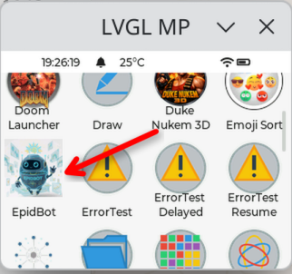
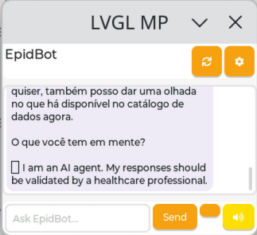

# EpidBot_MPOS

<div align="center">

[](.github/workflows/test.yml)
[](LICENSE)
[](https://micropython.org)
[](https://micropythonos.com)
[](https://github.com/Deeplearn-PeD/EpidBot_MPOS/releases)

</div>

Chat client for [EpidBot](https://github.com/fccoelho/epidbot) running on
[MicroPythonOS](https://micropythonos.com). Gives EpidBot users with an API key a
mobile chat interface with voice support: replies can be spoken aloud (TTS) and,
on devices with a microphone, messages can be dictated (STT) or transcribed from
a WAV file.

<div align="center">
<table>
  <tr>
    <td align="center"><br><sub>EpidBot in the MicroPythonOS launcher</sub></td>
    <td align="center"><br><sub>Chatting with EpidBot (TTS button on the right)</sub></td>
  </tr>
</table>
</div>

```
com_kwarai_epidbot/          the MicroPythonOS app (install this folder)
├── MANIFEST.JSON            app manifest (launcher activity)
├── icon_64x64.png
├── epidbot.py               chat Activity: LVGL UI, lifecycle, settings, voice flows
├── api.py                   EpidBot REST client (async, aiohttp) + markdown stripper
└── voice.py                 AudioManager record/playback helpers
tools/
├── make_icon.py             regenerates the icon (stdlib only)
├── install_desktop.sh       copies the app into a MicroPythonOS checkout
└── install_device.sh        copies the app to an ESP32 via mpremote
tests/test_logic.py          CPython unit tests for the pure logic (api.py)
```

## Features

- Chat with EpidBot via `POST /api/v1/chat` + `GET /api/v1/chat/{job_id}` polling
  (2 s interval, 3 min cap, cancellable), authenticated with your API key
  (`X-API-Key` header).
- Conversation continuity via EpidBot `session_id`; "New chat" (⟳) starts fresh.
- Markdown stripped for on-screen display (images dropped, links unwrapped,
  tables flattened).
- TTS: completed replies are read aloud via `POST /api/v1/voice/tts`
  (`format=wav`, the only format MicroPythonOS AudioManager can decode),
  length-capped (default 800 chars, configurable 200–2000).
- STT: on mic-equipped devices the 🎙 button records up to 15 s (16 kHz WAV) and
  transcribes via `POST /api/v1/voice/transcribe`; on devices without a mic the
  same button opens a WAV file picker instead.
- Errors surfaced inline: invalid key (401/403), daily quota (429), network and
  timeout failures.
- First-run setup prompts for API key and server URL; everything persists in
  MicroPythonOS SharedPreferences (per-app), including the last ~20 messages.
- **Browser provisioning**: API keys are ~67 characters — impractical on a
  touchscreen. First run (or a long-press on the gear) opens "Browser setup":
  the app serves a setup form over HTTP on port 8126 and shows the URL, a QR
  code and a 4-digit PIN on screen. Open the URL on any phone/computer on the
  same network, paste the key, enter the PIN, and the device picks it up and
  validates it. The server auto-closes after 5 minutes or when stopped.
- Settings (⚙): API key, server URL, language (en/pt/es, sent to the API), TTS
  voice, TTS max chars, TTS on/off.

## Installation

### Desktop (Linux/macOS, recommended for development)

```bash
git clone https://github.com/MicroPythonOS/MicroPythonOS.git ../MicroPythonOS
# build/run MicroPythonOS on desktop per its docs (scripts/build_mpos.sh linux)
tools/install_desktop.sh          # or: tools/install_desktop.sh /path/to/MicroPythonOS
```

Then start "EpidBot" from the launcher, or in the REPL:

```python
from mpos import AppManager
AppManager.start_app('com_kwarai_epidbot')
```

### ESP32 device

Flash MicroPythonOS for your board (web installer at
[install.micropythonos.com](https://install.micropythonos.com), or build +
esptool), connect USB, then:

```bash
tools/install_device.sh
```

> **Note on the Waveshare ESP32-S3-Touch-LCD-1.54:** this board is not yet in
> MicroPythonOS' supported-hardware list. A board definition (ST7789 240x240
> display, CST816T touch, ES8311 codec) adapted from the supported
> ESP32-S3-Touch-LCD-2 is needed before the app can run on it. The 1.54 has a
> speaker but **no microphone**, so voice input there is file-based only; TTS
> output works through the speaker.

## Getting an API key

Keys look like `ek_...` (64 hex chars). Create one with your EpidBot account:

```bash
curl -X POST https://api.epidbot.kwar-ai.com.br/api/v1/auth/login \
  -H "Content-Type: application/json" -d '{"email":"...","password":"..."}'
curl -X POST https://api.epidbot.kwar-ai.com.br/api/v1/auth/api-keys \
  -H "Authorization: Bearer <access_token>" -H "Content-Type: application/json" \
  -d '{"name":"micropythonos"}'
```

API access must be enabled for your account (daily token quotas apply; the app
shows quota errors as chat bubbles).

## Development

```bash
python3 tests/test_logic.py     # pure-logic tests, no device needed
python3 tools/make_icon.py      # regenerate the icon
```

The app targets MicroPython 1.20+ with the MicroPythonOS frameworks (`mpos`,
LVGL 9 bindings). `api.py` is deliberately mpos-free so it can be unit-tested
on CPython; HTTP goes through the MicroPythonOS-bundled async `aiohttp`, so all
network activity yields to the UI loop (no worker threads).

### Local MicroPythonOS build notes (Ubuntu 26.04 / GCC 15)

The desktop build required these small local patches to the MicroPythonOS
checkout (kept out of this repo; upstreamable):

- `scripts/build_mpos.sh`: added `-DSDL_PIPEWIRE=OFF -DSDL_CAMERA=OFF` to
  `SDL_FLAGS` (PipeWire headers too new; SDL camera pulls `libv4l2`)
- `lvgl_micropython/builder/unix.py`: dropped Clang-only
  `-Wno-unused-command-line-argument`, added
  `-Wno-error=unterminated-string-initialization` (GCC 15 + secp256k1)
- `secp256k1-embedded-ecdh/micropython.mk`: dropped Clang-only
  `-Wno-bitwise-instead-of-logical`
- `lvgl_micropython/ext_mod/c_mpos/micropython.mk`: webcam module (needs
  static `libv4l2.a`, not shipped by Ubuntu) now optional

### Roadmap

- WebSocket streaming (`/api/v1/chat/stream`) for token-by-token replies
- Board definition + bring-up for Waveshare ESP32-S3-Touch-LCD-1.54
- Server-driven voice list (from `GET /api/v1/voice/status`)
- Conversation history picker (EpidBot sessions API)

## License

See [LICENSE](LICENSE).
